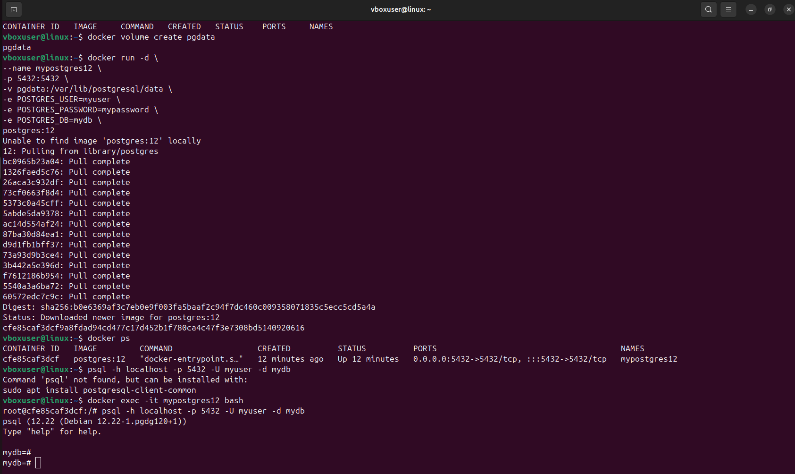
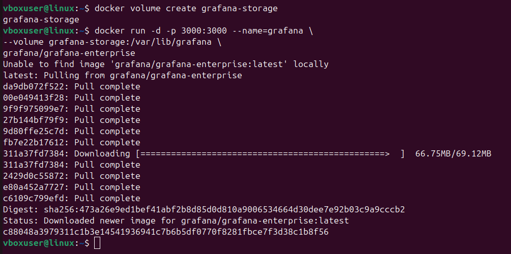
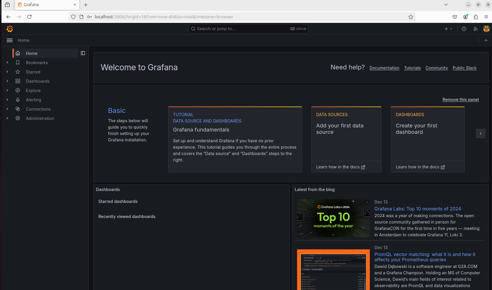
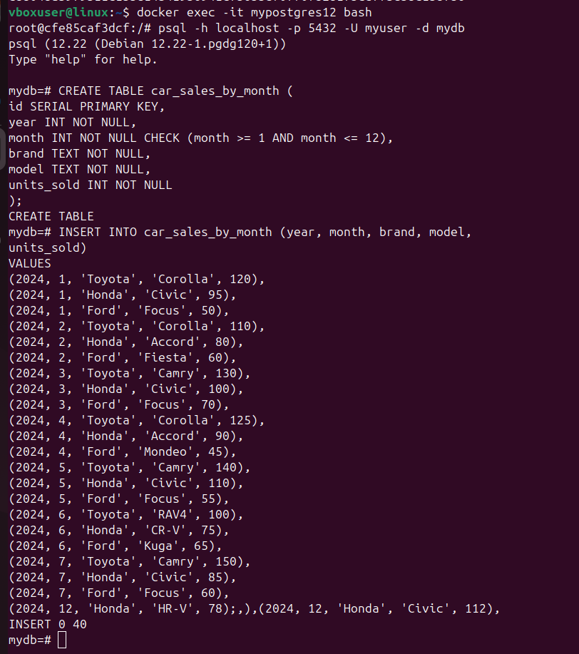
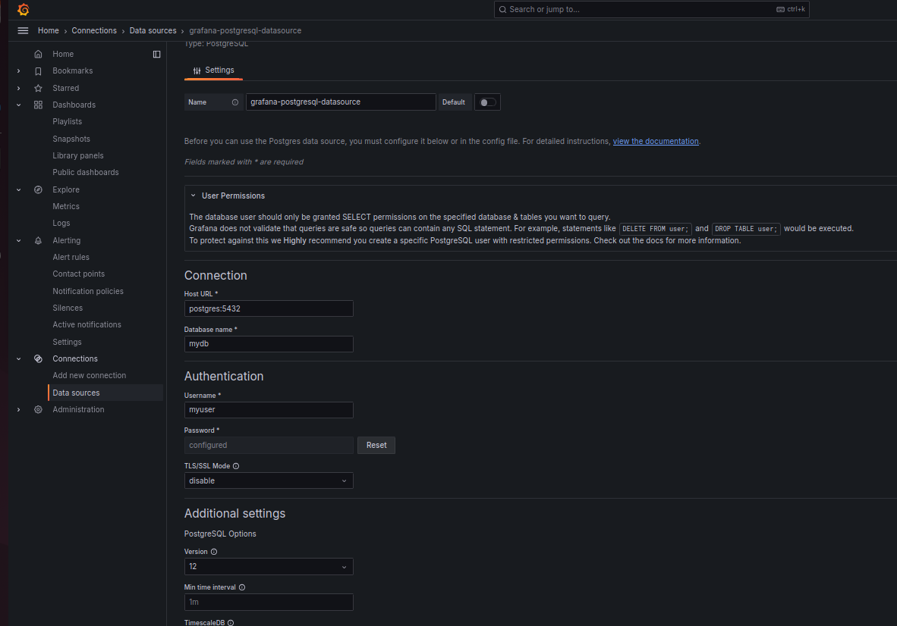
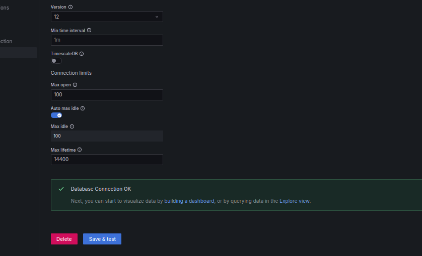
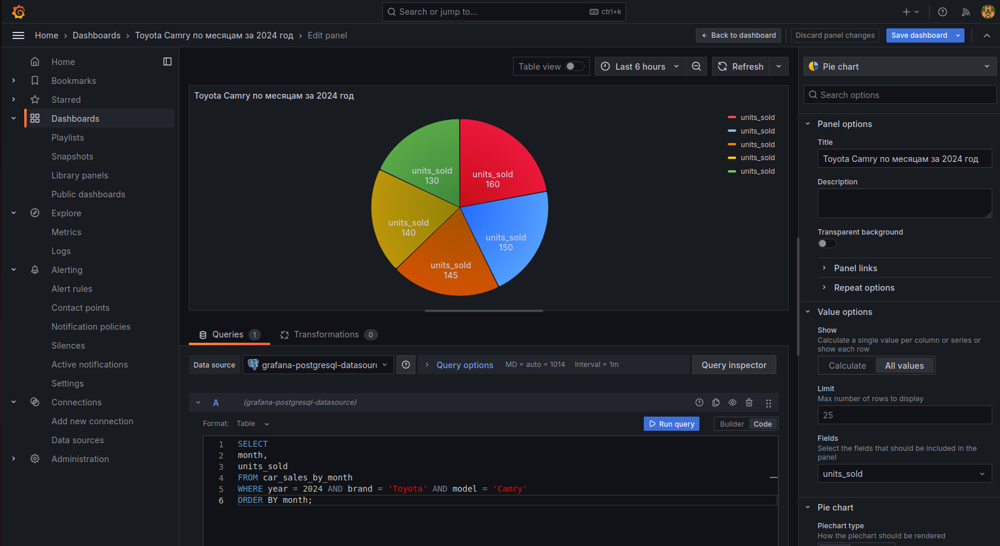

## HomeTask_10

### Часть 1: Подъем PostgreSQL 12 через Docker

__Результат__:

### Часть 2: Запуск Grafana через Docker

__Результат__:

### Часть 3: Создание таблицы в PostgreSQL

__Результат__:

### Часть 4: Вставка данных о продажах за 2024 год

__Результат__:

### Часть 5: Подключение Grafana к PostgreSQL и построение дашборда

__Результат__:

