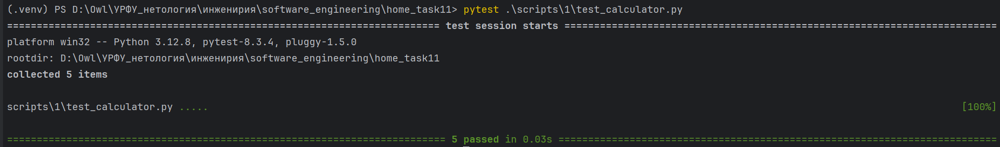
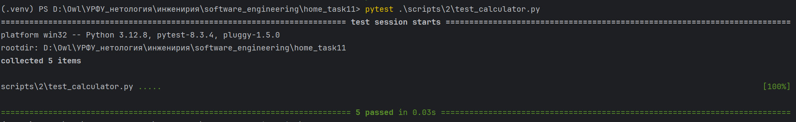
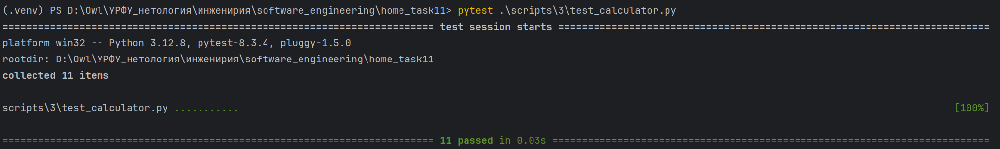
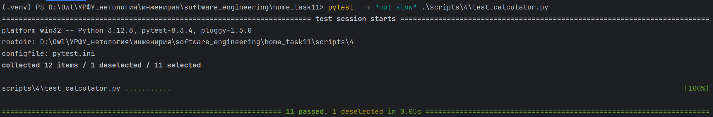
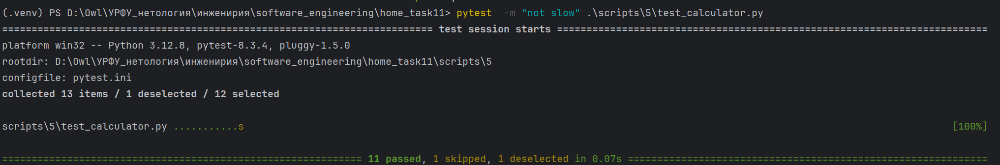
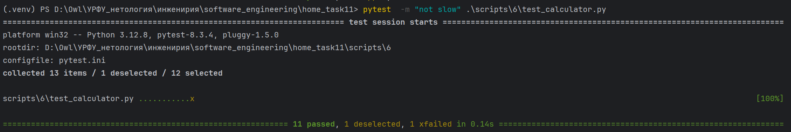

## HomeTask_11

### Упражнение 1. Написание простых тестов с использованием утверждений (assertions)

__Задание__:
Создать простую функцию и написать несколько тестов для неё, используя assert
для проверки результатов.

__Результат__:
Скрипт - [test_calculator.py](scripts/1/test_calculator.py)

### Упражнение 2. Использование фикстур

__Задание__:
Создать фикстуру, которая будет предоставлять объект калькулятора для тестов, чтобы избежать
повторяющегося кода и улучшить организацию тестов.

__Результат__:
Скрипт - [test_calculator.py](scripts/2/test_calculator.py)

### Упражнение 3. Параметризация тестов

__Задание__:
Протестировать функцию возведения числа в степень с различными наборами данных.

__Результат__:
Скрипт - [test_calculator.py](scripts/3/test_calculator.py)

### Упражнение 4. Маркировка тестов и пропуск тестов

__Задание__:
Отметить некоторые тесты как медленные и научиться их пропускать при запуске тестов.

__Результат__:
Скрипт - [test_calculator.py](scripts/4/test_calculator.py)

### Упражнение 5. Маркировка тестов и пропуск тестов

__Задание__:
Отметить некоторые тесты как пропуск тестов условно и научиться их пропускать при запуске тестов.

__Результат__:
Скрипт - [test_calculator.py](scripts/5/test_calculator.py)

### Упражнение 6. Маркировка тестов и пропуск тестов

__Задание__:
Отметить некоторые тесты как «тест временно не проходит» и научиться их пропускать при запуске тестов.

__Результат__:
Скрипт - [test_calculator.py](scripts/6/test_calculator.py)
