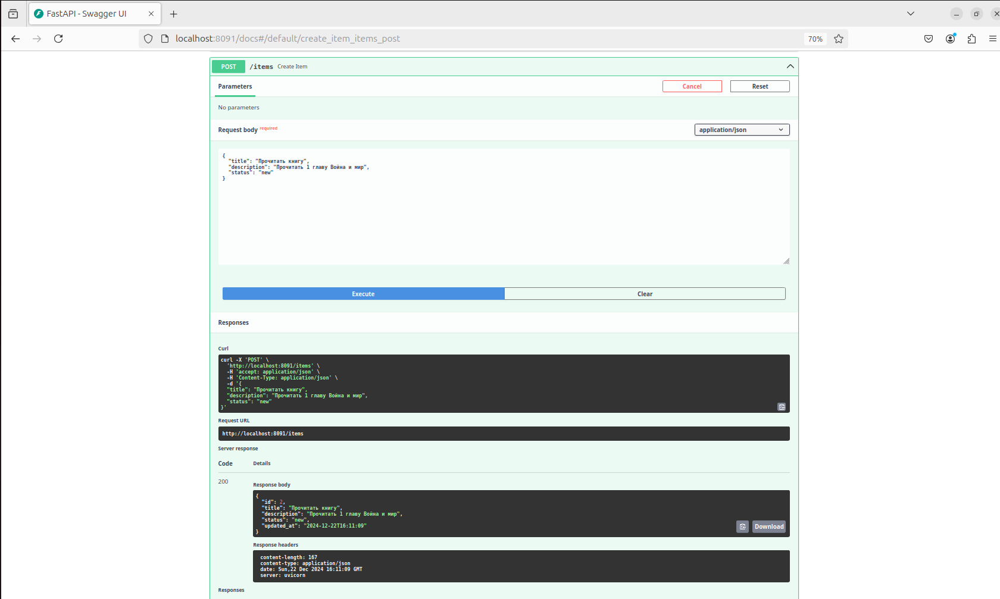
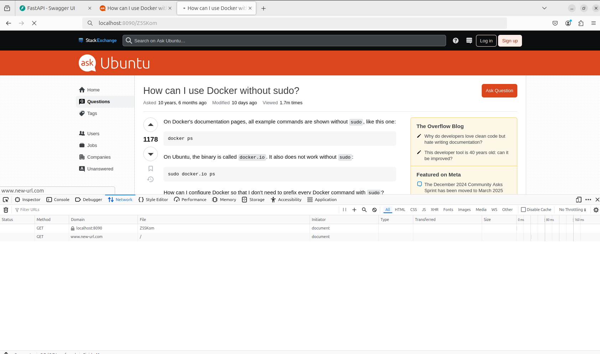
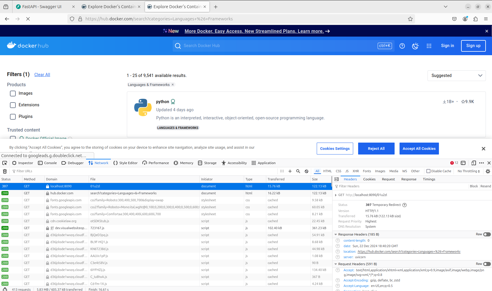

## Итоговое задание

### Задание

+ Разработать два микросервиса на базе FastAPI:
    + TODO-сервис: Реализует CRUD-операции для списка задач с
      хранением данных в SQLite.
    + Сервис сокращения URL (Short URL): Позволяет создавать
      короткие ссылки для длинных URL, перенаправлять по
      короткому идентификатору и предоставлять информацию о
      ссылке. Также хранение данных в SQLite.
+ Упаковать оба сервиса в Docker-контейнеры, используя
  именованные Docker-тома для сохранения данных.
+ После успешного локального запуска — залить исходный код в
  GitHub (в публичный репозиторий).
+ Собрать образы и опубликовать их на Docker Hub.

### Результат

#### TODO-сервис

+ Немного изменила модель, добавила статус ("new", "in_progress", "completed") и дату последнего изменения updated_at.
+ Добавила два новых эндпоинта для обновления статуса и просмотр списка дел по статусу.
  ```python
    @app.get("/items/status/{status}", response_model=List[TodoItem])
    def get_items_by_status(status: TodoStatus, db: Session = Depends(get_db)):
    items = db.query(TodoItemModel).filter(TodoItemModel.status == status).all()
    return items

    @app.put("/items/{item_id}/status", response_model=TodoItem)
    def update_item_status(item_id: int, status: TodoStatus, db: Session = Depends(get_db)):
    db_item = db.query(TodoItemModel).filter(TodoItemModel.id == item_id).first()

    check_item(db_item)

    db_item.status = status
    db.commit()
    db.refresh(db_item)
    return db_item
  ```
+ Создание контейнера
    ```bash
        docker build -t todo .
        docker run -d -p 8091:8091 -v todo_data:/todo/data --name todo todo
    ```
    
    
+ Проверка API
    
    
    
+ Проверка API в браузере через swagger
   http://localhost:8091

    
    
    
    
    
    
    
    
+ Опубликовать образ на Docker Hub
    https://hub.docker.com/repository/docker/lina2li/todo/general
    ```bash
         docker push lina2li/todo:latest
    ```
    
    

#### Сервис сокращения URL

+ Немного изменила код
+ Добавила два новых эндпоинта на обновление и удаление ссылок
    ```python
        @app.put("/{short_id}")
        def update_url(short_id: str, item: URLUpdate, db: Session = Depends(get_db)):
        url_item = db.query(URLItem).filter(URLItem.short_id == short_id).first()

        check_url(url_item)

        url_item.full_url = str(item.full_url)
        db.commit()
        db.refresh(url_item)
        return {"short_id": short_id, "full_url": url_item.full_url}


        @app.delete("/{short_id}")
        def delete_url(short_id: str, db: Session = Depends(get_db)):
        url_item = db.query(URLItem).filter(URLItem.short_id == short_id).first()

        check_url(url_item)

        db.delete(url_item)
        db.commit()
        return {"message": f"Ссылка {short_id} удалена"}

  ```
  
+ Создание контейнера
  ```bash
      docker build -t short_url .
      docker run -d -p 8091:8091 -v shorturl_data:/short_url/data --name short_url short_url
  ```
  
  
+ Проверка API
    
    
    
+ Проверка API в браузере через swagger
   http://localhost:8090

    
    
    
    
    
    
    
    
+ Опубликовать образ на Docker Hub
    https://hub.docker.com/repository/docker/lina2li/short_url/general
    ```bash
         docker push lina2li/short_url:latest
    ```
    
    