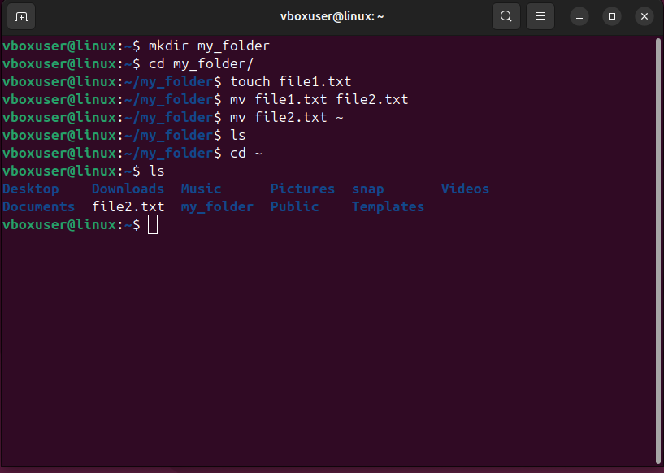
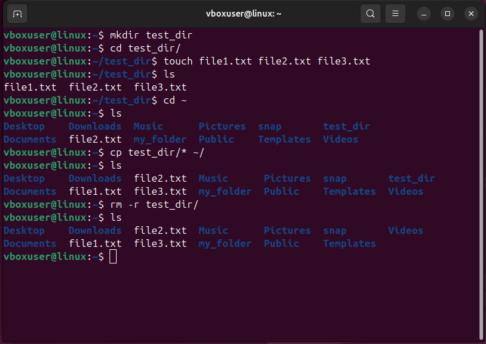
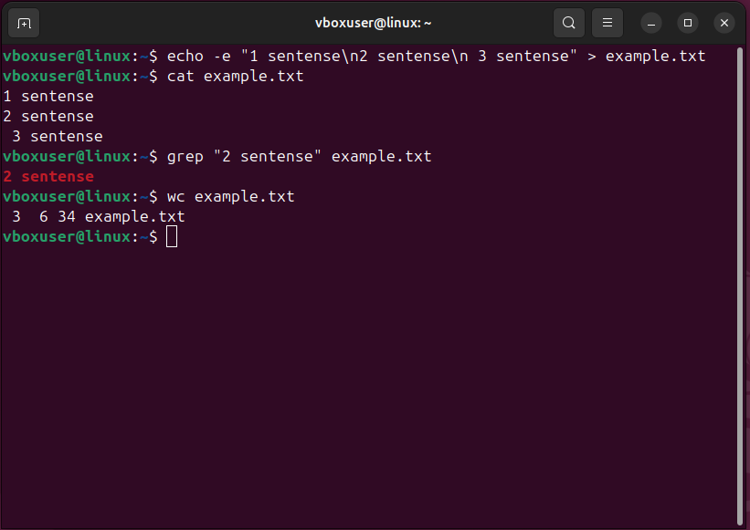
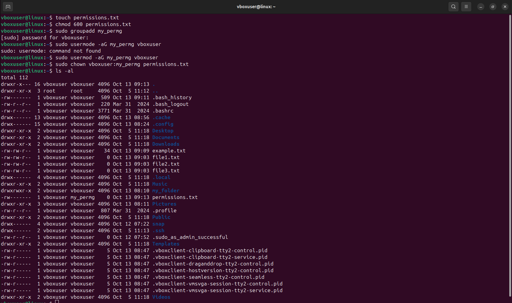
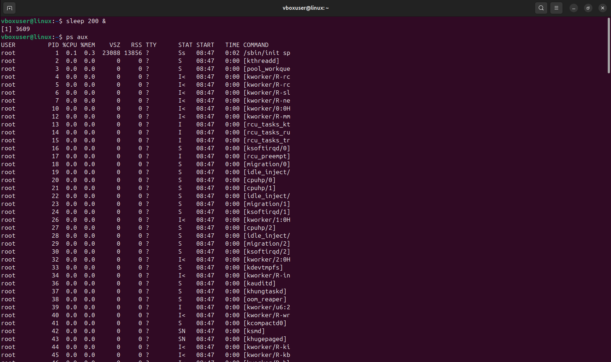
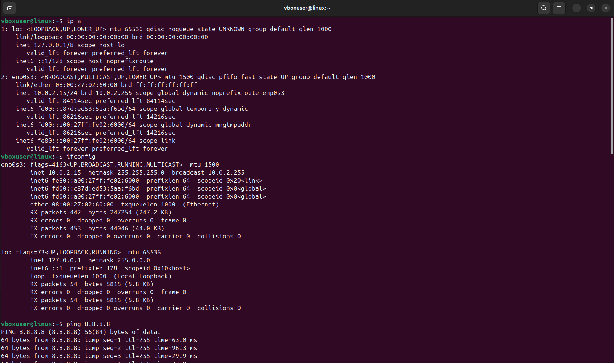
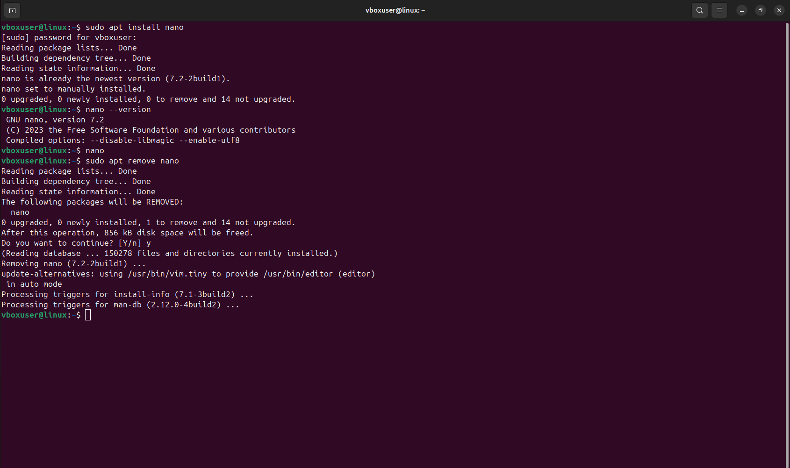
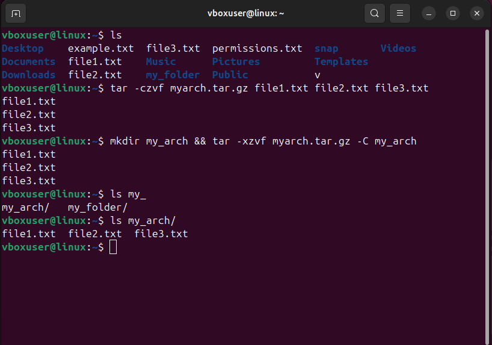

## HomeTask_2

### Кейс 1: Основные команды и навигация

__Задание__:
1. Перейти в домашний каталог.
2. Создать новую директорию my_folder.
3. Перейти в созданную директорию и создать пустой файл file1.txt.
4. Переименовать файл file1.txt в file2.txt.
5. Переместить файл file2.txt в домашний каталог.

__Ожидаемый результат__:
+ Директория my_folder создана. 
+ Файл file1.txt создан и переименован в file2.txt. 
+ Файл file2.txt перемещен в домашний каталог.

__Результат__:

### Кейс 2: Управление файлами и каталогами

__Задание__:
1. Создать директорию test_dir и внутри нее создать несколько файлов
(file1.txt, file2.txt, file3.txt).
2. Вывести список файлов в каталоге.
3. Скопировать все файлы из test_dir в домашний каталог.
4. Удалить каталог test_dir и все его содержимое.

__Ожидаемый результат__:
+ Директория test_dir и файлы внутри нее созданы.
+ Список файлов выведен.
+ Файлы скопированы в домашний каталог.
+ Директория test_dir и ее содержимое удалены.

__Результат__:

### Кейс 3: Работа с текстовыми файлами

__Задание__:
1. Создать текстовый файл example.txt и добавить в него несколько строк
текста.
2. Вывести содержимое файла на экран.
3. Использовать команду grep для поиска строки в файле.
4. Использовать команду wc для подсчета строк, слов и символов в файле.

__Ожидаемый результат__:
+ Файл example.txt создан и заполнен текстом.
+ Содержимое файла выведено на экран.
+ Команда grep нашла нужную строку.
+ Команда wc подсчитала строки, слова и символы.

__Результат__:

### Кейс 4: Права доступа к файлам и каталогам
__Задание__:
1. Создать файл permissions.txt.
2. Изменить права доступа к файлу так, чтобы только владелец мог его читать и
изменять.
3. Создать новую группу и добавить в нее пользователя.
4. Изменить владельца и группу файла permissions.txt.

__Ожидаемый результат__:
+ Файл permissions.txt создан.
+ Права доступа изменены.
+ Новая группа создана и пользователь добавлен.
+ Владелец и группа файла изменены.

__Результат__:

### Кейс 5: Управление процессами
__Задание__:
1. Запустить команду, которая будет выполняться в фоновом режиме.
2. Вывести список всех процессов.
3. Найти запущенный процесс и завершить его.

__Ожидаемый результат__:
+ Команда запущена в фоновом режиме.
+ Список процессов выведен.
+ Процесс найден и завершен.

__Результат__:

.png)
.png)

### Кейс 6: Сетевые команды
__Задание__:
1. Проверить IP-адрес машины.
2. Использовать команду ping для проверки соединения с внешним сервером.
3. Проверить открытые порты с помощью команды netstat или ss.

__Ожидаемый результат__:
+ IP-адрес машины проверен.
+ Команда ping использована для проверки соединения.
+ Открытые порты проверены.

__Результат__:

.png)

### Кейс 7: Установка и управление пакетами
__Задание__:
1. Установить текстовый редактор (например, nano).
2. Проверить, что редактор установлен и запустить его.
3. Удалить установленный редактор.

__Ожидаемый результат__:
+ Редактор nano установлен.
+ Редактор запущен и затем удален.

__Результат__:

### Кейс 8: Резервное копирование и архивация
__Задание__:
1. Создать архив из нескольких файлов.
2. Разархивировать созданный архив в другую директорию.

__Ожидаемый результат__:
+ Архив создан.
+ Архив успешно разархивирован.

__Результат__:
