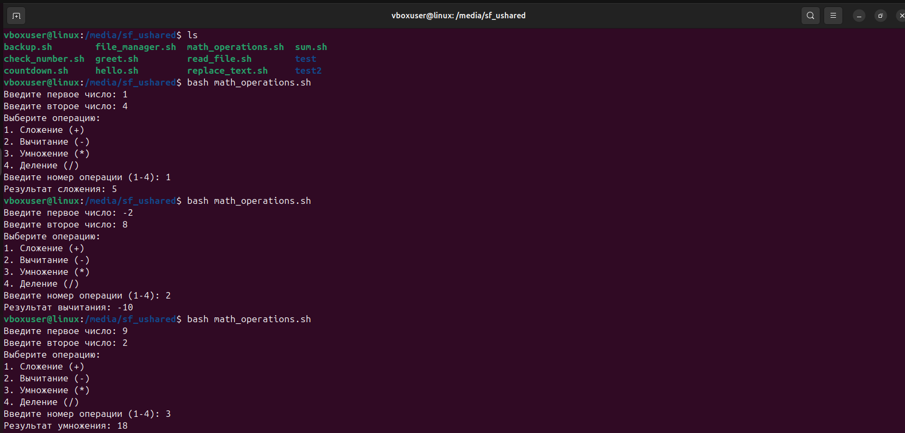

## HomeTask_5

### Кейс 1: Написание простого скрипта

__Задание__:
1. Написать скрипт hello.sh, который выводит на экран "Hello, World!".

__Ожидаемый результат__:
* Скрипт hello.sh создан и выводит "Hello, World!" при запуске.

__Результат__:
Скрипт - [hello.sh](hello.sh)

### Кейс 2: Работа с переменными

__Задание__:
1. Написать скрипт greet.sh, который запрашивает имя пользователя и
приветствует его по имени.

__Ожидаемый результат__:
* Скрипт greet.sh запрашивает имя и выводит приветствие, например, "Hello,
John!".

__Результат__:
Скрипт - [greet.sh](greet.sh)

### Кейс 3: Условные операторы

__Задание__:
1. Написать скрипт check_number.sh, который запрашивает у пользователя
число и выводит сообщение о том, положительное это число, отрицательное
или ноль.

__Ожидаемый результат__:
* Скрипт check_number.sh корректно определяет и выводит сообщение о знаке
введенного числа.

__Результат__:
Скрипт - [check_number.sh](check_number.sh)

### Кейс 4: Циклы

__Задание__:
1. Написать скрипт countdown.sh, который принимает число в качестве
аргумента и выводит обратный отсчет от этого числа до нуля.

__Ожидаемый результат__:
* Скрипт countdown.sh корректно выполняет обратный отсчет.

__Результат__:
Скрипт - [countdown.sh](countdown.sh)

### Кейс 5: Работа с файлами и каталогами

__Задание__:
1. Написать скрипт file_manager.sh, который создает директорию, переходит в
нее, создает внутри несколько файлов, затем удаляет их и выходит из
директории.

__Ожидаемый результат__:
* Скрипт file_manager.sh создает и удаляет файлы в указанной директории.

__Результат__:
Скрипт - [file_manager.sh](file_manager.sh)

### Кейс 6: Обработка аргументов командной строки

__Задание__:
1. Написать скрипт sum.sh, который принимает два числа в качестве аргументов
командной строки и выводит их сумму.

__Ожидаемый результат__:
* Скрипт sum.sh корректно принимает аргументы и выводит их сумму.

__Результат__:
Скрипт - [sum.sh](sum.sh)

### Кейс 7: Чтение из файла

__Задание__:
1. Написать скрипт read_file.sh, который читает содержимое файла строка за
строкой и выводит их на экран.

__Ожидаемый результат__:
* Скрипт read_file.sh корректно читает и выводит содержимое файла.

__Результат__:
Скрипт - [read_file.sh](read_file.sh)

### Кейс 8: Редактирование файлов

__Задание__:
1. Написать скрипт replace_text.sh, который заменяет все вхождения
определенного слова в файле на другое слово.

__Ожидаемый результат__:
* Скрипт replace_text.sh корректно выполняет замену текста в файле.

__Результат__:
Скрипт - [replace_text.sh](replace_text.sh)

### Кейс 9: Автоматизация задач

__Задание__:
1. Написать скрипт backup.sh, который копирует все файлы из одной директории
в другую и добавляет текущую дату к имени каждого файла.

__Ожидаемый результат__:
* Скрипт backup.sh корректно выполняет резервное копирование файлов с
добавлением даты к имени.

__Результат__:
Скрипт - [backup.sh](backup.sh)

### Кейс 10: Использование функций

__Задание__:
1. Написать скрипт math_operations.sh, который содержит функции для
сложения, вычитания, умножения и деления двух чисел. Скрипт должен
запрашивать у пользователя два числа и операцию, которую нужно выполнить.

__Ожидаемый результат__:
* Скрипт math_operations.sh корректно выполняет математические операции
с использованием функций.

__Результат__:
Скрипт - [math_operations.sh](math_operations.sh)

