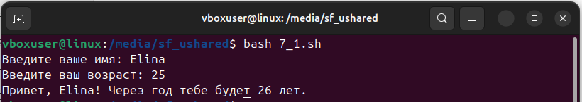
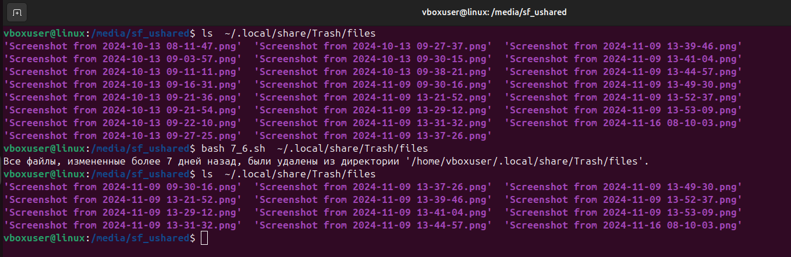
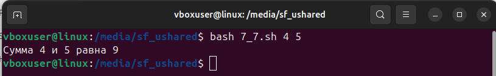
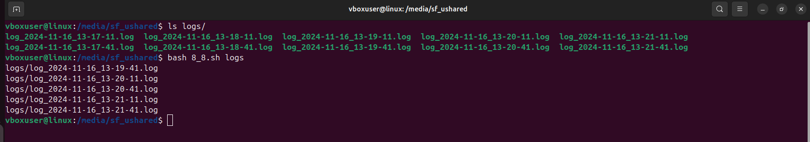
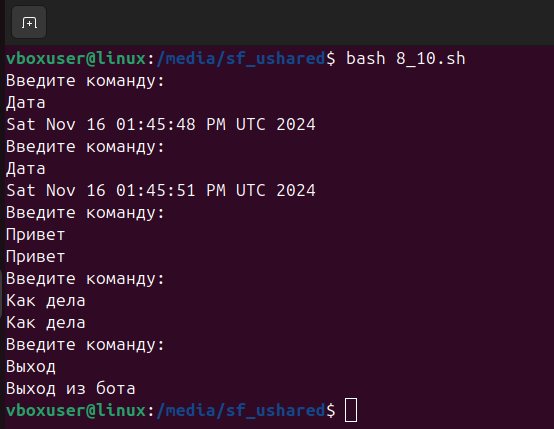

## HomeTask_6

### Вебинар 7. Упражнение 1

__Задание__:
Напишите скрипт, который запрашивает у пользователя его имя и возраст,
а затем выводит сообщение:
«Привет, [имя]! Через год тебе будет [возраст + 1] лет.»

__Результат__:
Скрипт - [1.sh](vebinar_7/7_1.sh)

### Вебинар 7. Упражнение 2

__Задание__:
Напишите скрипт, который проверяет, существует ли файл,
указанный пользователем. Если файл существует, должно выводиться:
«Файл найден!»
Если нет — «Файл не найден.»

__Результат__:
Скрипт - [2.sh](vebinar_7/7_2.sh)

### Вебинар 7. Упражнение 3

__Задание__:
Скрипт должен создавать архив (tar.gz) для указанной директории.
Имя архива должно включать текущую дату.

__Результат__:
Скрипт - [3.sh](vebinar_7/7_3.sh)

### Вебинар 7. Упражнение 4

__Задание__:
Напишите скрипт, который принимает на вход имя файла
и выводит количество строк в нём.

__Результат__:
Скрипт - [4.sh](vebinar_7/7_4.sh)

### Вебинар 7. Упражнение 5

__Задание__:
Напишите скрипт, который добавляет префикс backup_ ко всем файлам
в указанной директории.

__Результат__:
Скрипт - [5.sh](vebinar_7/7_5.sh)

### Вебинар 7. Упражнение 6

__Задание__:
Напишите скрипт, удаляющий все файлы в директории,
которые были изменены более 7 дней назад.

__Результат__:
Скрипт - [6.sh](vebinar_7/7_6.sh)

### Вебинар 7. Упражнение 7

__Задание__:
Создайте скрипт с функцией add, которая принимает два аргумента
и выводит их сумму.

__Результат__:
Скрипт - [7.sh](vebinar_7/7_7.sh)

### Вебинар 7. Упражнение 8

__Задание__:
Напишите скрипт, который проверяет использование диска
и выводит предупреждение, если использование превышает 80%.

__Результат__:
Скрипт - [8.sh](vebinar_7/7_8.sh)

### Вебинар 7. Упражнение 9

__Задание__:
Напишите скрипт, который запускает указанную пользователем команду
в фоне и выводит её PID.

__Результат__:
Скрипт - [9.sh](vebinar_7/7_9.sh)

### Вебинар 8. Упражнение 1

__Задание__:
Напишите скрипт, который принимает имя файла и слово для поиска
и выводит количество вхождений этого слова.

__Результат__:
Скрипт - [1.sh](vebinar_8/8_1.sh)

### Вебинар 8. Упражнение 2

__Задание__:
Напишите скрипт, который принимает два числа и выводит информацию
о том, какое из них больше или меньше, либо о том, что числа равны.

__Результат__:
Скрипт - [2.sh](vebinar_8/8_2.sh)

### Вебинар 8. Упражнение 3

__Задание__:
Скрипт должен сгенерировать пароль заданной длины,
содержащий буквы и цифры.

__Результат__:
Скрипт - [3.sh](vebinar_8/8_3.sh)

### Вебинар 8. Упражнение 4

__Задание__:
Напишите скрипт, который пингует сервер и выводит сообщение
о его доступности.

__Результат__:
Скрипт - [4.sh](vebinar_8/8_4.sh)

### Вебинар 8. Упражнение 5

__Задание__:
Скрипт должен изменить имена всех файлов в директории на строчные буквы.

__Результат__:
Скрипт - [5.sh](vebinar_8/8_5.sh)

### Вебинар 8. Упражнение 6

__Задание__:
Напишите скрипт, который отслеживает изменение указанного файла
и уведомляет об этом.

__Результат__:
Скрипт - [6.sh](vebinar_8/8_6.sh)

### Вебинар 8. Упражнение 7

__Задание__:
Напишите скрипт для отправки сообщения в Telegram через API.

__Результат__:
Скрипт - [7.sh](vebinar_8/8_7.sh)

### Вебинар 8. Упражнение 8

__Задание__:
Напишите скрипт, который находит все файлы логов в директории,
сортирует их по времени создания и выводит 5 самых старых
файлов.

__Результат__:
Скрипт - [8.sh](vebinar_8/8_8.sh)

### Вебинар 8. Упражнение 9

__Задание__:
Напишите скрипт, который запускает несколько команд параллельно
и ждёт их завершения.

__Результат__:
Скрипт - [9.sh](vebinar_8/8_9.sh)

### Вебинар 8. Упражнение 10

__Задание__:
Скрипт должен реагировать на команды пользователя и выполнять
соответствующие действия. Например, при вводе Дата бот
должен выводить текущую дату.

__Результат__:
Скрипт - [10.sh](vebinar_8/8_10.sh)
