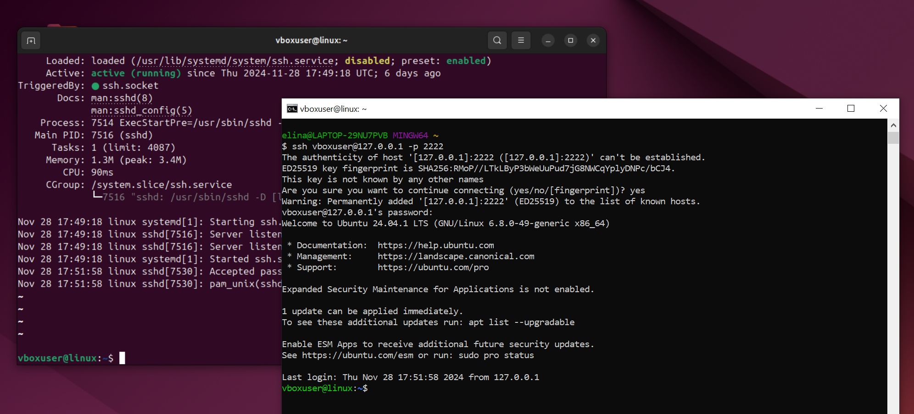
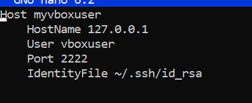

## HomeTask_7

### Кейс 1: Установка и настройка SSH-сервера

__Задание__:
1. Установить SSH-сервер на виртуальную машину (например, с помощью sudo
apt-get install openssh-server).
2. Настроить SSH-сервер, убедиться, что он запущен, и проверить его статуc.

__Результат__:

### Кейс 2: Подключение к удаленному серверу

__Задание__:
1. Использовать команду ssh для подключения к удаленному серверу.
2. Подключиться к серверу с использованием имени пользователя и IP-адреса
(например, ssh user@192.168.1.100).

__Результат__:

### Кейс 3: Копирование файлов с помощью SCP

__Задание__:
1. Использовать команду scp для копирования файла с локальной машины на
удаленный сервер.
2. Копировать файл с удаленного сервера на локальную машину

__Результат__:

### Кейс 4: Работа с ключами SSH

__Задание__:
1. Сгенерировать пару ключей SSH с помощью команды ssh-keygen.
2. Добавить публичный ключ на удаленный сервер для безпарольного входа.
3. Подключиться к серверу с использованием ключей SSH.

__Результат__:

### Кейс 5: Настройка файла конфигурации SSH

__Задание__:
1. Создать или отредактировать файл конфигурации SSH (~/.ssh/config).
2. Добавить алиас для быстрого подключения к серверу (например, задать имя
сервера и ключи).

__Результат__:

