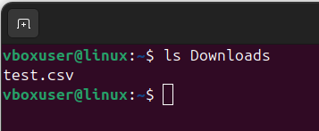
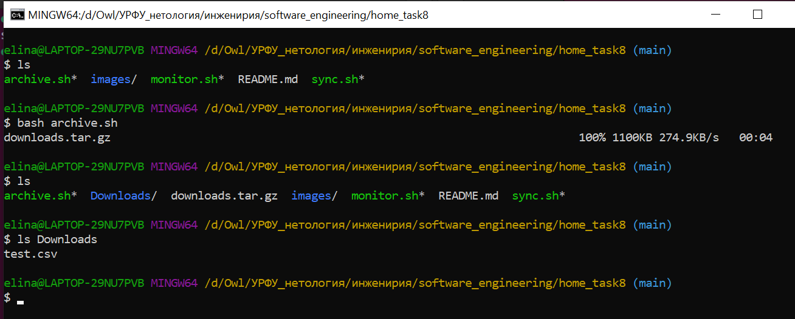
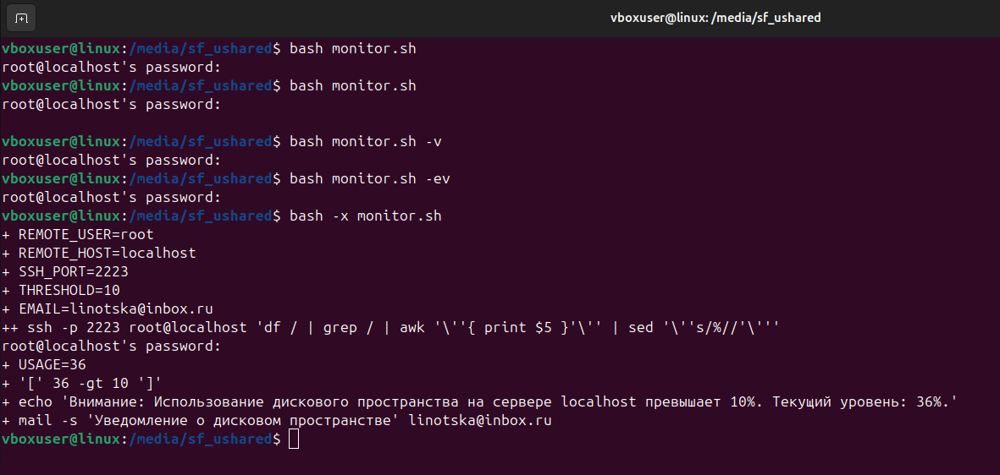
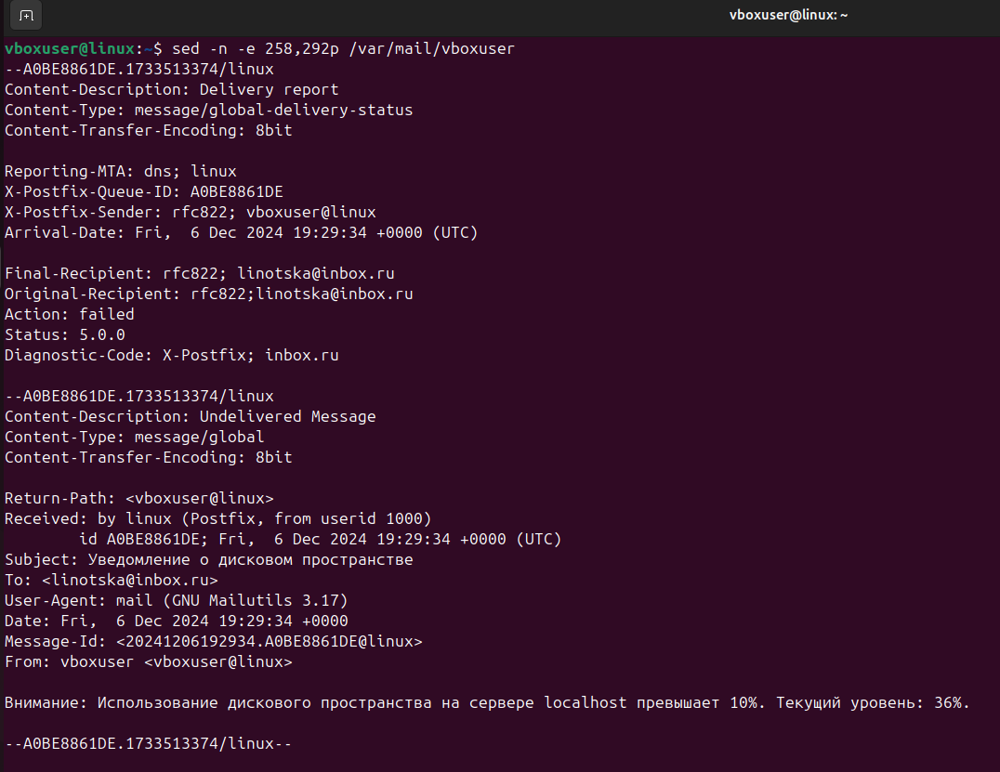
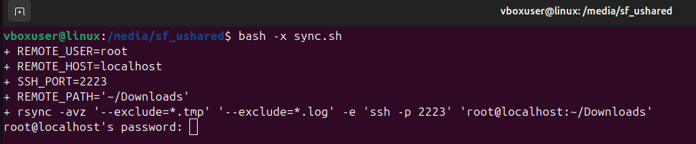
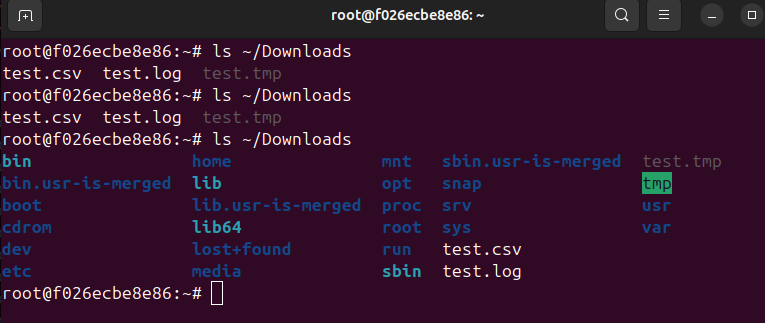

## HomeTask_8

### Задание 1: Архивирование файлов и скачивание с сервера с последующим разархивированием

__Задание__:
Написать Bash-скрипт, который:
1. Подключается к удалённому серверу по SSH.
2. Архивирует указанную директорию на удаленном сервере.
3. Скачивает созданный архив на локальную машину с помощью scp.
4. Разархивирует архив на локальной машине

__Результат__:
Скрипт - [archive.sh](archive.sh)

### Задание 2: Мониторинг свободного места на сервере

__Задание__:
Написать Bash-скрипт, который:
1. Подключается к удалённому серверу по SSH.
2. Проверяет процент использования дискового пространства.
3. Если использование превышает заданный порог, отправляет уведомление по
электронной почте.

__Результат__:
Скрипт - [monitor.sh](monitor.sh)

### Задание 3: Синхронизация файлов между локальной машиной и удалённым сервером

__Задание__:
Написать Bash-скрипт, который:
1. Синхронизирует файлы между локальной директорией и удаленной с
использованием rsync по SSH.
2. Игнорирует определённые типы файлов или директории.

__Результат__:
Скрипт - [sync.sh](sync.sh)

