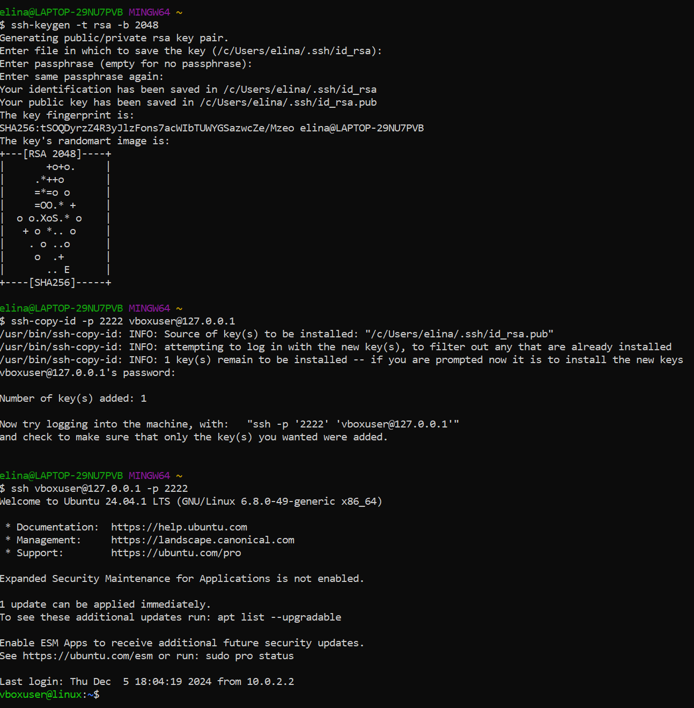
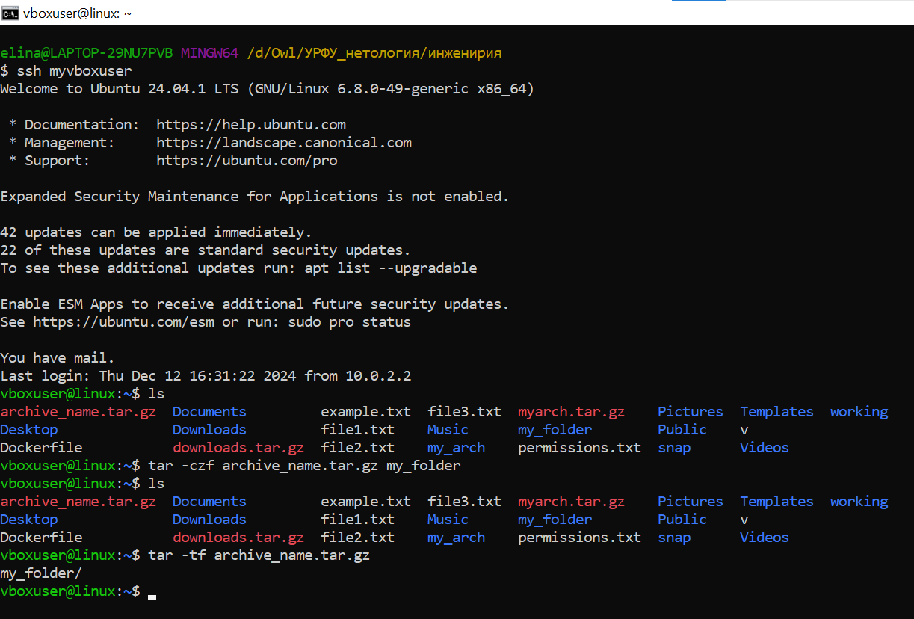
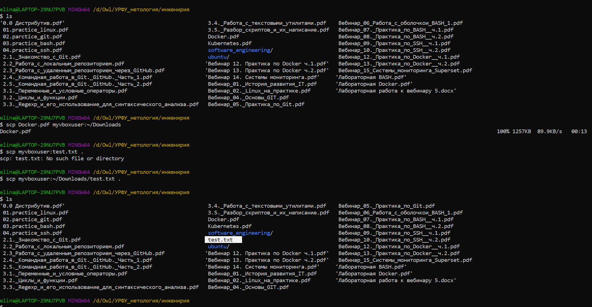
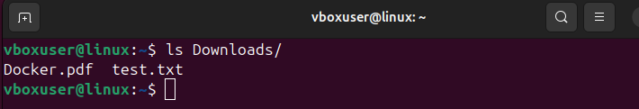

## HomeTask_8

### Задание 1: Настройка SSH-аутентификации по ключу

__Задание__:
Необходимо сгенерировать ключ SSH на локальной машине, скопировать публичный
ключ на удаленный сервер и убедиться, что вход по SSH возможен без пароля. Это
позволит в дальнейшем автоматизировать скрипты и задачи, не требуя ручного ввода
учетных данных.

__Результат__:

### Задание 2: Создание архивов на удаленной машине

__Задание__:
Требуется сформировать архивы на удаленном сервере, используя штатные средства
(например, tar). Необходимо подготовить исходные данные, создать один или
несколько архивов и проверить их целостность. Это позволит структурировать данные,
экономить место и упростить дальнейшие операции с файлами.

__Результат__:

### Задание 3: Перенос файлов и архивов между локальным хостом и удаленной машиной

__Задание__:
Предстоит выполнить операцию по загрузке или скачиванию файлов (например,
скопировать подготовленные архивы с сервера на локальный компьютер и, наоборот,
отправить файлы с локального хоста на удаленную машину) с использованием
инструментов переноса (например, scp или rsync). Это закрепит навыки управления
файлами в распределенных системах.

__Результат__:

